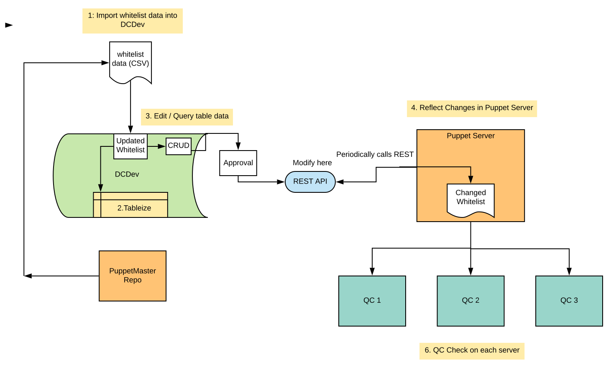

# CM-08 Whitelist
The CM-08 whitelist is an on platform solution for streamlining the whitelist validation process
needed for the build and installation of our servers.
This application provides a central and secure environment where you can change and query
the whitelist and dynamically update those changes in our PuppetMaster repo.

### Background
Every time a server on our system is installed its package inventory must validated through
a whitelist (list of authorized packages a server can install). Originally, This whitelist
was a static .txt file in our puppet master repo. In order to push any sort of change to this file
you must do the following:
1. Manually update change in whitelist file
2. Commit changes and hold a code review
3. Wait for merge / approval
4. Run puppet on repeat until it arrives to a stable state (20-30 minute process)

Additionally, if whitelist validation fails our servers will receive unwanted alerts and errors related
to the build process. Originally, we had to resort to workarounds for these alerts (things like
temporarily disabling our whitelist file) in order for our builds to run successfully.

### Solution
In order to streamline the entire whitelist validation process we need to achieve the following:
* Create a central place where we can interact and modify our whitelist
* Maintain a secure environment where we can manage whitelist information
* Implement a consistent system that ensures any server is equipped with the authorized software it needs

### User Stories
A list of user's perspectives and use cases regarding the benefits of our CM-08 Whitelist

1. (Systems Engineer): As a Systems Engineer, I would like a central place where I can add,
 edit, and query whitelisted packages so that I can streamline the entire whitelist
 validation process.
 
2. (Security Solutions Architect): As a Security Solutions Architect, I would like an environment
 where I can validate and secure whitelist package information so that I can ensure
 our infrastructure runs safely.

3. (Systems Administrator): As a Systems Administrator, I would like an interface where I
can scan for whitelist build failures so that I can ensure the whitelist validation
process is reliable.

4. (Auditor): As an Auditor, I need to ensure that any authorized software installation I
choose for an audit is consistent with all of the packages in my server.

5. (Site Reliability Engineer): As a Site Reliability Engineer, I would like to receive 
real time alerts whenever one of my servers are built with unauthorized packages.

### High Level Overview
#### Phase 1:
Phase 1 consists of the minimal features needed for our CM-08 Whitelist to be accepted
and utilized. Below is a high level overview of our MVP implementation:

Implementation:
1. Whitelist data imported into Data Center Dev environment
2. Scoped app on platform that tablelizes that data
3. Method to edit / query table data and make available for export
4. REST API to GET whitelist from platform to puppetmaster repo
6. Cron Job to periodically call REST API and build whitelist file in designated directory

#### Phase 2:
Phase 2 consists of extra features that can make our whitelist process more extensive and reliable.
Below are possible ideas of phase 2 features:
* Create a schema for our table with different fields (env, fileType, name)
* Create on platform option to export as a txt file (so parsing is not needed)
* Create config file in order to store variables such as:
[DestinationDirectory][Connection Server][filename][filetype]

#### Phase 3:
Phase 3 consists of security features that make our whitelist process safer and more restrictive.
Below are possible ideas of phase 3 features:
* Restrict permissions of access to on platform scoped app
* Raise an error to REST API if fileType is not app/db
* Raise an error if we encounter a * in our list (we cannot have a star because tha will enable everything)

### Deployment
Once our Python REST API is created and returns our desired whitelist.txt file
we need to make the script available for puppet servers in production environment.
#### Implementation:
* Checked out feature branch in private PuppetMaster repo
* Puppet script that calls Python script & creates a Cron Job to run that script periodically
### Added
* STRY11105872: Document architecture of CM-08 whitelist storage and data flow [Scrum view*]
